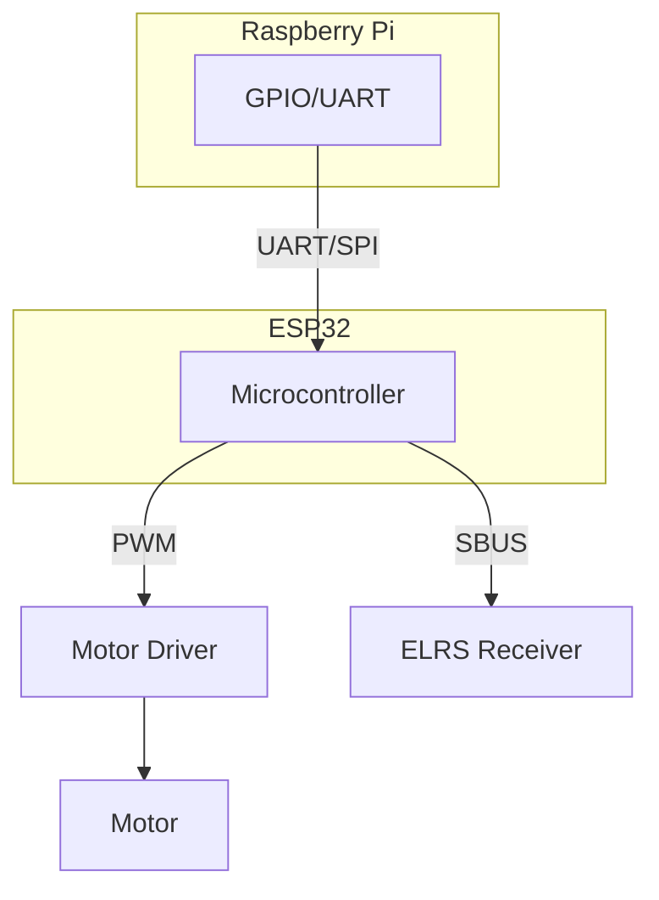

# System Control Flow

```mermaid
flowchart TD
    subgraph Raspberry Pi
        RPi[GPIO/UART]
    end
    
    subgraph ESP32
        MCU[Microcontroller]
    end
    
    RPi -->|UART/SPI| MCU
    MCU -->|PWM| MD[Motor Driver]
    MD --> Motor
    MCU -->|SBUS| ELRS[ELRS Receiver]
```

